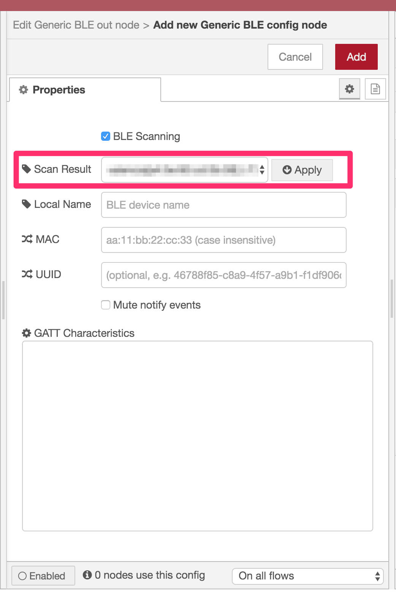

node-red-contrib-generic-ble
===

A Node-RED node for providing access to generic BLE peripheral devices via GATT.

As of v4.0.0, this node is optmized for Linux with BlueZ 5.

Supported operations are as follows:

- Read
- Write
- Write without Response
- Notify

In this version, the node status values are as follows:

- `missing` the configured BLE peripheral device is missing.　When the device is discovered, the state transitions to `disconnected`. The `disconnected` device may transiton to `missing` again when RSSI is invalidated (Linux only)
- `disconnected` when the configured BLE peripheral device is found but not conncted
- `connecting` when the configured BLE peripheral device is being connecting
- `connected` when the configured BLE peripheral device is connected
- `disconnecting` when the configured BLE peripheral device is being disconnecting
- `error` when unexpected error occurs

# How to use

## How to configure a new BLE peripheral device

At first, drag either a `generic ble in` node or a `generic ble out` node to the workspace from the node palette and double-click the node. And you can find the following dialog. Here, click the pencil icon (`1`) to add a new BLE peripheral or edit the existing one.


Then the new config node dialog appears like this.


The `Scan Result` shows the scanned BLE peripherals. It can be empty when no peripherals are found.

In order for the dialog to list your device, turn BLE on prior to open the dialog. Close the dialog then re-open it if you'd like to get the latest scan result.

By default, you have to enter either MAC address or UUID manually to configure your BLE peripheral. However, by checking `Select from scan result`(`2`), you can choose the peripheral if it exists in the scan result.



When you choose the peripheral, `GATT Characteristics` shows all characteristics discovered in it, and `Local Name`, `MAC` and `UUID` are automatically resolved as well.

If you cannot find your peripheral in the `Scan Result`, you can reload the result by closing this dialog and re-opening it as described above.

Click `Add` (`3`) when the information on the dialog looks good.


Click `Done` (`4`) to finish the `ble in` node settings.

## How to translate gatttool command into flow

In this example, we show how to describe `gatttool` commands for characteristic value write and read with Generic BLE nodes.

### Characteristics Value Write

The following simple command line just issues a characteristic write request to the handle `0x0027`, which the BLE peripheral associates with the characteristic uuid `f000aa02-0451-4000-b000-000000000000`(uuids and handles can be listed by `gatttool -b 88:99:00:00:FF:FF --characteristics command`).

```
$ gatttool -b 88:99:00:00:FF:FF --char-write-req --handle=0x0027 --value=ca
Characteristic value was written successfully
```

In this tutorial, we translate the above command into Node-RED flow.

First of all, we use the following nodes.

1. `inject` node to trigger a write request
1. `Generic BLE out` node to perform the write request


So the first step to create a flow is to place the above nodes on the workspace and connect them as shown above.

Next, open the `inject` dialog so that you can provide the write request parameters, the characteristic uuid and the value.

**Important!) Unlike `gatttool`, Generic BLE nodes NEVER use `handles`. Always use `uuid`s instead.**


In this dialog, choose `JSON` at Payload input item since `Generic BLE out` node accepts a JSON object as its input value. See `Inputs` in the node description shown in the `info` tab for detail.


Click/tap `...` to launch JSON value editor and populate the following JSON text.

```
{
    "f000aa0204514000b000000000000000": "ca"
}
```

The property `f000aa0204514000b000000000000000` is a characteristic `uuid`. However, unlike `gatttool`, you must strip hyphens from the original uuid value. `Generic BLE` nodes doesn't accept `gatttool` style uuid format.

The value `ca` is a hex string to be written, which is identical to the above command line.

So you'll see the following image.


Close the dialog by clicking `Done` button after entering the JSON text.

Configure `Generic BLE out` node for your BLE peripheral (This step is already introduced above so we don't describe here. See `How to configure a new BLE peripheral`).

Now you're ready to issue a characteristic write request to your BLE peripheral. Click `Deploy` and click `inject` node to issue a characteristic write request.


Node-RED shows the notification message after your write request is performed successfully.

Here in this tutorial, we use `inject` node to create characteristic write request parameters. However, this isn't the only way to do so. You can use other nodes than `inject` node. All you need is to prepare a valid JSON object for `Generic BLE out` node and provide it to the node.

In order to retrieve the written value from your BLE peripheral, go to the next step.

### Characteristics Value Read

The both commands perform characteristic value read commands and return the same result, the characteristic value of the uuid `f000aa02-0451-4000-b000-000000000000`.

```
$ gatttool -b 88:99:00:00:FF:FF --char-read -u f000aa02-0451-4000-b000-000000000000
handle: 0x0027 	 value: ca

$ gatttool -b 88:99:00:00:FF:FF --char-read --handle=0x0027
Characteristic value/descriptor: ca
```

In this tutorial, we translate the above commands into Node-RED flow.

We use the following nodes this time.

1. `inject` node to trigger a read command
1. `Generic BLE in` node to perform the read command
1. `debug` node to show the read value


Put the above nodes onto your workspace and add connectors like above.

Open `inject` node dialog and enter the characteristic `uuid` at Topic input box. Leave default values other than Topic since `Generic BLE in` sees only the topic value.

You can also leave Topic empty when you want to retrieve all characteristics values.


Click `Done` after entering the uuid to close the dialog. You need to configure `Generic BLE in` node to use your BLE peripheral but we skip to mention here as the instruction is described above (See `How to configure a new BLE peripheral` for detail).

Click `Deploy` to function the flow.


Let's read the characteristic value by clicking `inject` node pedal. The read result will be displayed on the debug tab.

## BLE in and out nodes

See `info` tab for detail on the editor UI.

# Example Flow

You can import [the example flow](examples/01-read-write.json) on Node-RED UI.

# Installation Note (Linux)

The Node-RED process owner must belong to `bluetooth` group.
For example, if you're going to run the process by `pi` user, run the following command.

```
sudo usermod -G bluetooth -a pi
```

Then reboot the OS so that the policy changes take effect.

```
sudo reboot
```

## Node-RED users

Run the following commands:
```
cd ~/.node-red
npm install node-red-contrib-generic-ble
```

Then restart Node-RED process.

## CANDY RED users

Run the following commands:
```
cd $(npm -g root)/candy-red
sudo npm install --unsafe-perm node-red-contrib-generic-ble
```

Then restart `candy-red` service.

```
sudo systemctl restart candy-red
```

# Appendix

## How to build

```
# build
$ NODE_ENV=development npm run build
# package
$ NODE_ENV=development npm pack
```
