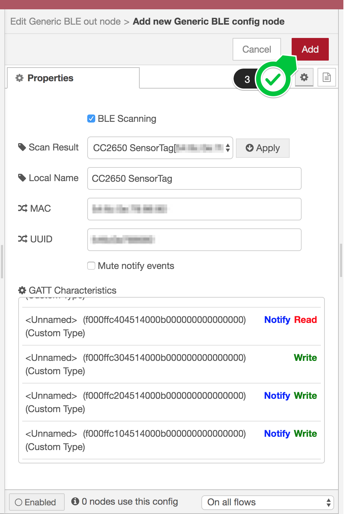

node-red-contrib-generic-ble
===

A Node-RED node for providing access to generic BLE devices via GATT.

Supported operations are as follows:

- Read
- Write
- Write without Response
- Notify

Read and Write operations are performed asynchronously and they're stored into the separate queues (read queue and write queue). Each queue has up to 10 operation requests. The parameter can be modified by providing an environmental variable `GENERIC_BLE_MAX_REQUESTS`.

# How to use

## How to configure a new BLE peripheral

At first, drag either a `generic ble in` node or a `generic ble out` node to the workspace from the node palette and double-click the node. And you can find the following dialog. Here, click the pencil icon (`1`) to add a new BLE peripheral or edit the existing one.


Then the new config node dialog appears like this.


The `Scan Result` shows the scanned BLE peripherals. It can be empty when no peripherals are found.

In order for the dialog to list your device, turn BLE on prior to open the dialog. Close the dialog then re-open it if you'd like to get the latest scan result.

By default, you have to enter either MAC address or UUID manually to configure your BLE peripheral. However, by checking `Select from scan result`(`2`), you can choose the peripheral if it exists in the scan result.


When you choose the peripheral, `GATT Characteristics` shows all characteristics discovered in it, and `Local Name`, `MAC` and `UUID` are automatically resolved as well.

If you cannot find your peripheral in the `Scan Result`, you can reload the result by closing this dialog and re-opening it as described above.

Click `Add` (`3`) when the information on the dialog looks good.



Click `Done` (`4`) to finish the `ble in` node settings.

## BLE in and out nodes

See `info` tab for detail on the editor UI.

# Example Flow

You can import [the example flow](examples/01.read-write.json) on Node-RED UI. You need to change Generic BLE config node named `nRF5x` or add a new config node for your device.

# Systemwide Configuration

These are environmental variables for systemwidely configuring this node:

| Variable | Description |
|----------|-------------|
| `GENERIC_BLE_CONNECTION_TIMEOUT_MS`  | Connection Timeout in milliseconds. 5s by default |
| `GENERIC_BLE_CONCURRENT_CONNECTIONS` | Number of Concurrent BLE connections. 1 by default |
| `GENERIC_BLE_READ_WRITE_INTERVAL_MS` | Read/Write operation interval in milliseconds. 50ms by default |
| `GENERIC_BLE_OPERATION_WAIT_MS`      | Default waiting time for Read/Write/Notify response per characteristic. 500 by default |
| `GENERIC_BLE_MAX_REQUESTS`           | The length of Read/Write operation queues. 10 by default |

You can easily get started with importing the example flow from the menu icon > `Import` > `Examples` > `generic ble`.

# How to install

This will take approx. 3 minutes on Raspberry Pi 3.

## Node-RED users

Run the following commands:
```
cd ~/.node-red
sudo npm install --unsafe-perm node-red-contrib-generic-ble
```

Then restart Node-RED process.

When you have trouble with connecting your BLE devices, reset your HCI socket by the following command.

```
# STOP Node-RED first!!
sudo hciconfig hci0 reset
```
And restart Node-RED.

## CANDY RED users

Run the following commands:
```
cd $(npm -g root)/candy-red
sudo npm install --unsafe-perm node-red-contrib-generic-ble
```

Then restart `candy-red` service.

```
sudo systemctl restart candy-red
```
The above command performs `hciconfig hci0 reset` as well. So you don't have to run `hciconfig` command separately.

# Appendix

## How to build

```
# build
$ NODE_ENV=development npm run build
# package
$ NODE_ENV=development npm pack
```

## HCI Dump Debugging (Raspbian/Ubuntu/Debian)

```
sudo apt-get update
sudo apt-get install bluez-hcidump
```

then

```
sudo hcidump -t -x
```

## Enabling trace log

Set `GENERIC_BLE_TRACE=true` on starting Node-RED and you can find the precise log in `/var/log/syslog`.

# Revision History
* ?.?.?
  - Support characteristic query by one or more uuids
  - Add `Mute Notify Events` to `Generic BLE` config node for this node to avoid unnecessary device connection for event subscription
  - Replace `RED.log` functions with node logging functions as possible to offer precise logging control via UI
  - Add `Operation Timeout` to `Generic BLE` config node to set the waiting time for Read/Write/Notify response **per characteristic** rather than per device
  - `GENERIC_BLE_OPERATION_WAIT_MS` is introduced for default `Operation Timeout` value
  - Remove `Listening Period` from `Generic BLE` config node
  - `GENERIC_BLE_NOTIFY_WAIT_MS` is removed
* 1.0.2
  - Improve README
  - Add an example flow file available from the editor UI

* 1.0.1
  - Fix an issue where custom characteristics cannot be listed on the Generic BLE config node dialog

* 1.0.0
  - Fix an issue where some devices cannot be discovered within a specific time window even after they can be connected
  - Fix an issue where the Scan Result select widget didn't show the same item as the stored device info
  - Update Scan Result option list whenever Local Name is resolved
  - Improve stability by fixing minor bugs

* 0.1.0
  - Initial Release (alpha)
  - `node-red` keyword is not yet added
